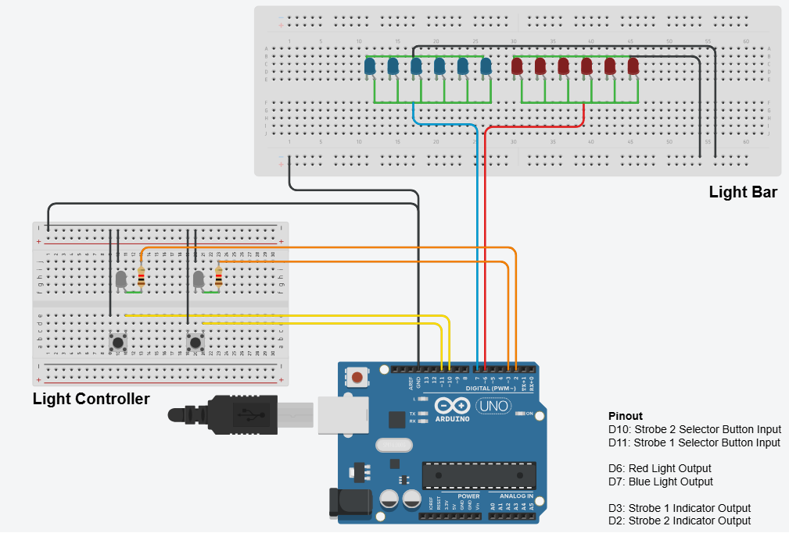

# Police-Light-Bar
A light bar and controller project controlled by Arduino firmware.

This project simulates a police light bar using an Arduino. It features two lighting modes:  
1. **Fast Strobe Mode** - Rapid flashing of red and blue lights in bursts.  
2. **Strobe Mode** - Alternating flashing of red and blue lights at a slower rate.  

Both modes can be toggled using push buttons, and indicator LEDs display the active mode.  

## Features
- Uses an Arduino to control red and blue light bars.
- Two toggleable flashing patterns.
- Physical button inputs to switch modes.
- Indicator LEDs to show which mode is active.

## Hardware Requirements
- **Arduino Board** (e.g., Arduino Uno)
- **Red and Blue LEDs** (or LED strips for light bars)
- **Resistors** (if needed for LEDs)
- **Push buttons** (for mode selection)
- **Indicator LEDs** (to show the active mode)
- **Wires and Breadboard**

## Wiring and Pinout
| Component                 | Arduino Pin |
|---------------------------|------------|
| Red Light Bar            | 6          |
| Blue Light Bar           | 7          |
| Fast Strobe Button       | 10         |
| Strobe Button           | 11         |
| Fast Strobe Indicator LED | 2          |
| Strobe Indicator LED     | 3          |

## Schematic
The wiring schematic for this project is included in the `media` folder within this repository.  

## Code Explanation
The Arduino sketch controls the light bar's flashing modes based on button presses:  
- **Fast Strobe Mode**: Quick bursts of flashes alternating between red and blue.  
- **Strobe Mode**: Alternating flashes with a longer delay.  
- The buttons toggle these modes on and off.  
- Indicator LEDs light up to show which mode is active.  

## How to Use
1. Upload the provided Arduino code to your board.
2. Wire the components as per the schematic.
3. Press the **Fast Strobe Button** (left button) to activate/deactivate fast strobe mode.
4. Press the **Strobe Button** (right button) to activate/deactivate normal strobe mode.
5. The indicator LEDs will turn on to show the active mode.

## License
This project is open-source and free to use for educational purposes.

---

Feel free to modify and expand upon this project!
